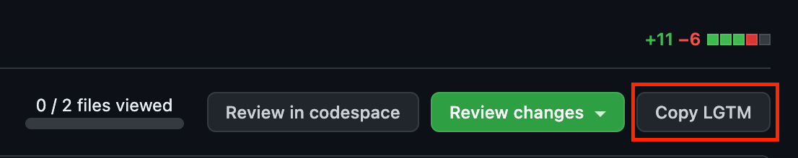

  
  <h1 style="margin-top:12px;">LGTM Extension</h1>

<h2>What is this app?</h2>

This application is the easiest way to copy LGTM images on GitHub.

<h2>How to use</h2>
<ol>
  <li>Install this extension in your browser.</li>
  <li>Please review it in a pull request in any repository on GitHub.</li>
  <li>
    
Click this button.

    
  </li>
  <li>Now that the LGTM image has been copied, please Approve and paste the image.</li>
</ol>
