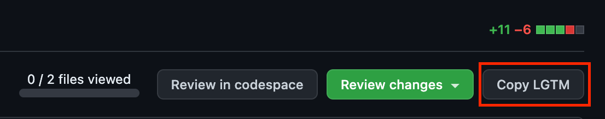

  
  <h1 style="margin-top:12px;">Copy LGTM</h1>
  
The easiest way to add LGTM images to your GitHub pull request reviews.

  <video src="https://github.com/hayato-osh/copy-lgtm/assets/74091672/c1b068a1-0b4f-4723-8aaa-dae3fc8632a0">
    Demo
  </video>

<h2>Usage</h2>
<ol>
  <li>Install this extension in your browser.</li>
  <li>Open the <b>Files changed</b> tab of any pull request on GitHub.</li>
  <li>
    
Click the <b>Copy LGTM</b> button next to the review button.

    
  </li>
  <li>The review dialog opens with a random LGTM image already inserted into the comment. Submit your review.</li>
</ol>

<h2>Options</h2>

Open the extension popup to configure:

<ul>
  <li><b>Custom images</b>: register up to 8 of your own image URLs (<code>https://</code> only). When set, they are used instead of the built-in images.</li>
  <li><b>Automatically select "Approve"</b>: check the "Approve" option in the review dialog when an LGTM image is inserted.</li>
</ul>

<h2>Supported pages</h2>
<ul>
  <li>The new "Files changed" experience (<code>/pull/N/changes</code>)</li>
  <li>The legacy "Files changed" page (<code>/pull/N/files</code>)</li>
</ul>
